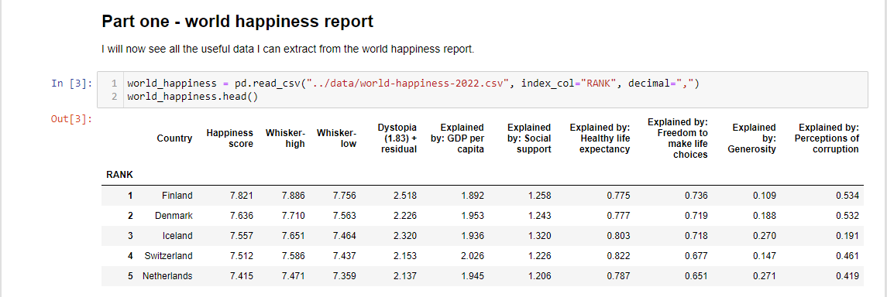
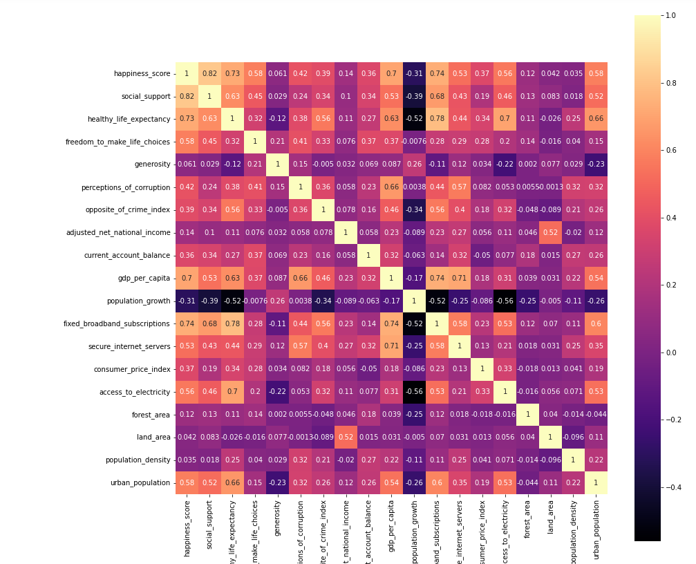
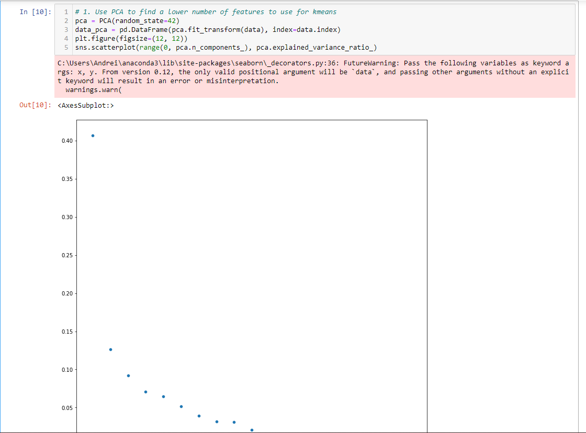
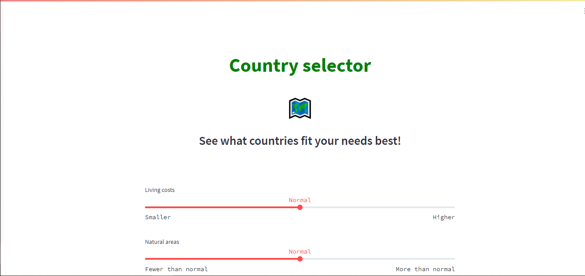
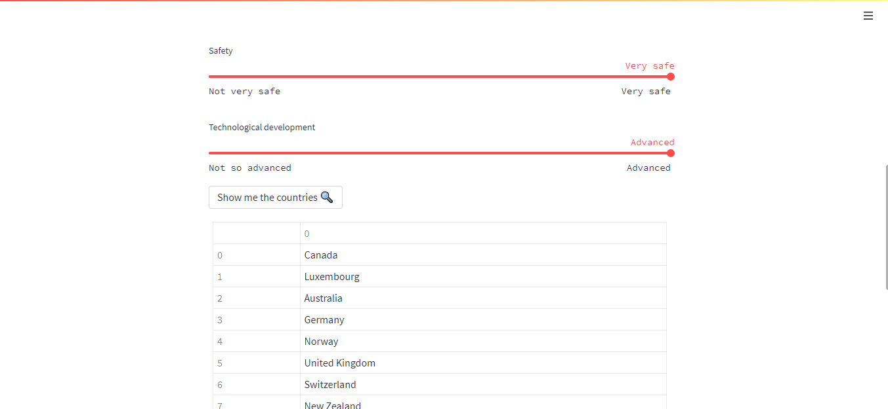

<h1 style="text-align: center"> 🌍 Country Selector </h1>

## Business Case

This project aims to answer an interesting question: what countries would fit me
the most if I wanted to change states? I believe that a lot of people have the
opportunity to work remotely now and can decide to travel or even settle in a
new country. Using general data about countries, one can gain a little bit of
insight about what group of countries would suit her/his needs.

Using clustering we can split all the countries into groups and then draw
different conclusions about those groups. The aim was to find all
characteristics that differentiate these groups and use them for the little
country selector recommendation system.

## Table of Contents

Show/Hide

1. [File/Folder descriptions](#1-filefolder-descriptions)
2. [Data preparation](#2-data-preparation)
3. [EDA and clustering](#3-eda-and-clustering)
    * [3.1 Exploratory data analysis](#31-exploratory-data-analysis)
    * [3.2 Clustering](#32-clustering)
4. [Web application](#4-web-application)
5. [Conclusion](#5-conclusion)
    * [5.1 What did I learn?](#51-what-did-i-learn)
    * [5.2 Future improvements](#52-future-improvements)

## 1. File/Folder descriptions

Show/Hide

* **data**: folder in which all data is stored
    * Economy.xlsx: excel formatted data about economy of countries from https://data.worldbank.org/
    * education.xlsx: excel formatted data about education of countries from https://data.worldbank.org/
    * employment.xlsx: excel formatted data about employment of countries from https://data.worldbank.org/
    * financial-indicators.xlsx: excel formatted data about financial indicators of countries from
  https://data.worldbank.org/
    * health.xlsx: excel formatted data about health of countries from https://data.worldbank.org/
    * infrastructure.xlsx: excel formatted data about infrastructure of countries from https://data.worldbank.org/
    * mean-temperature.nc: netcdf formatted data about temperatures of countries from 
  https://climateknowledgeportal.worldbank.org/download-data
    * population-and-environment.xlsx: excel formatted data about population and environment of countries from 
  https://data.worldbank.org/
    * poverty.xlsx: excel formatted data about poverty of countries from https://data.worldbank.org/
    * precipitation.nc: excel formatted data about rain statistics of countries from 
  https://climateknowledgeportal.worldbank.org/download-data
    * private-sector.xlsx: excel formatted data about the private sector of countries from https://data.worldbank.org/
    * public-sector.xlsx: excel formatted data about the public sector of countries from https://data.worldbank.org/
    * world-happiness-2022.csv: the world happiness report from 2022
    * crime-rates.json: json formatted data about crime index of countries from https://worldpopulationreview.com/
    * cleaned_data.csv: csv formatted data about countries resulted from preprocessing; this data is used for the
  application
    * cleaned_data_min_max.csv: csv formatted data about countries resulted from preprocessing using a MinMaxScaler
    * cleaned_data_standard.csv: csv formatted data about countries resulted from preprocessing using a StandardScaler
    * groups.json: json file containing the 6 groups resulted from the clustering process
    * group_scores.json: json files containing scores for each group for the 6 indices I decided on in the
  clustering notebook
    
* **notebooks**: where the jupyter notebooks and adjacent python scripts are stored
  * **1. Data Preprocessing.ipynb**: notebook used for preprocessing all data about countries
  * **2. EDA and Clustering.ipynb**: notebook used for clustering which resulted in countries grouping
  * **python-scripts**: folder which contains python scripts used in notebooks and tests for functions where possible
    * **development**: folder in which all python scripts reside
      * **preprocessing_functions.py**: script containing functions used in notebooks
      * **preprocessing_variables.py**: script containing variables used in notebooks
      * **clustering_functions.py**: script containing functions used in notebooks
    * **test**: folder containing test modules
      * **test_preprocessing_functions.py**: unit test module for functions in preprocessing_functions.py

* **research.txt**: text file I used to quickly find the most important factors for choosing a country where to move to
* **images**: folder holding images used in the presentation file

## 2. Data preparation

Show/Hide

The work here was done in the [data processing notebook.](./notebooks/1.Data%20Preprocessing.ipynb)

I have downloaded data from different sites. I based my logic on research I have done in the 
[research file](research.txt). I wanted to see what are the main factors that people look for when
moving to a different country. After I have made a list, I went on and searched for data.
Because I did not manage to find one single place in which to download all data, I did not spend additional time
to learn the API of any particular site, but rather downloaded the raw data myself.

  

 
 

I have put all the data in the [data folder](./data/) and went through it all and tried to make one clean dataset.
Some of the data such as precipitation, temperature, education, employment, poverty, private and public sector 
did not make it into the final set due to the lack of values for the majority of the countries.

Therefore, the [final dataset](./data/cleaned_data.csv) contains data about 117 countries. This data refers to: 
happiness, economy, crime rate, infrastructure, finance, health, population and environment. A total of 22 columns were 
extracted, making this dataset a 117 x 22 dataframe. This is the dataset used to create clusters upon which the 
application is built.

## 3. EDA and clustering

Show/Hide

In the [2nd notebook](./notebooks/2.%20EDA%20and%20Clustering.ipynb) of this project I experiment with clustering.
What I wanted to find was a good grouping of countries such that I can build a web app
that recommends what country you can move into based on certain criteria. These criteria would be discovered by 
clustering: create groups via clustering, then find criteria for each group and note them on a scale. In the final app
the user will choose a number on each scale and the application will output the most appropriate country group.

### 3.1 Exploratory data analysis

Show/Hide

The preprocessed data turned out to be mostly ok, with the exception that I had the gdp per capita and consumer prices
as redundant features. The correlation matrix also helped me see what kind of features are correlated and it looked like
it was a group of 5 features that might have had something close to a linear relationship.

  

 
 

### 3.2 Clustering

Show/Hide

This is the main part of the project. After having read a little bit about all the clustering option offered by the
sci-kit learn library, I have decided on the following 4 to try for my project: K-Means, DBSCAN, AffinityPropagation and
AgglomerativeClustering. 

Because my data is unlabeled, the only way through which I could compare the algorithms was by comparing silhouette
scores (the silhouette score measures how well the clustering are spaced between each other and how tight are points 
within clusters) and other metrics. The other 2 metrics that I found relevant to use were the Calinski-Harabasz score 
and the Davies-Bouldin score. These are both metrics used to measure how well the clusters are delimited.

I have started with the requirement that I need at least 4 groups in order to have a meaningful end project. Less than 
4 groups would give me too many values in each group and make it hard for the end user to choose.

The scores I would get using the features as they were did not seem to indicate good clustering. Therefore, I also
used 
[VarianceThreshold](https://scikit-learn.org/stable/modules/generated/sklearn.feature_selection.VarianceThreshold.html) 
and [PCA](https://scikit-learn.org/stable/modules/generated/sklearn.decomposition.PCA.html) as feature manipulation 
methods. The latter managed to lead to good enough results by keeping 3 generated principal components
(silhouette score over 0.3).

  

 
 

In the end I opted for a K-Means clustering solution with 6 clusters. It did not have the highest silhouette score, but
amongst the highest. It fitted my end goal, and I believe that there's always room for compromise.
For each cluster, I also sorted the countries so that those that are most representative of their cluster are first in
their group list.

## 4. Web application

Show/Hide

(Might not be always available)
 
Application link: http://54.226.224.89:8501/

  

 
 

  

 
 

This is the end application. An end user can input his desires for the 6 aforementioned indices and get a list of
countries which have values similar to those.

I wanted to create an application because I wanted to experiment with deployment and also
having an end product. The deployment was done using Amazon AWS.

Steps to follow if you want to run the application on your machine:

1. Pull this repository from git
2. Make sure you have python and pip installed
3. Install streamlit and numpy using pip
4. Go to the client directory of this project, open a command line and type
"streamlit run app.py"
5. The web app should be accessible now at http://localhost:8501 or the provided link in your console

## 5. Conclusion

Show/Hide

You cannot divide world countries in very exact groups without missing vital parts out. This project was an interesting
experiment to learn about clustering and project deployments. I am now more curious as to what kind of clustering
projects would have a bigger impact and how they can help us when we deal with uncertainty.

### 5.1 What did I learn?

Show/Hide

This project was a great opportunity to try my hands at clustering. I have read about it, I have searched different 
methods to cluster and how to evaluate clustering results. It was also nice to read about people's opinions about
clustering as a general method. An interesting idea I have gotten is: we always look for patterns, even where there
are none; it's just how our brains work.

Philosophy aside, I discovered the streamlit library and how easy it is to make a web page using python. Another
interesting addition to my toolkit was managing to deploy the app to the Amazon aws cloud service. It was also nice to
use different feature extraction/selection methods and select the best out of them.

I always like the feeling at the end of the project when I am writing the README file, making sure that everything is ok
and well documented. It's the moment I can finally say: It's done. And the feeling when you've done something is one of
the best, especially when you think about all the obstacles you encountered.

### 5.2 Future improvements

Show/Hide

There are a few things I would improve this project with, if I am ever going to attack it again:

- get more data about more countries (and make sure it is actual data and not null)
- try even more feature selection/extraction methods
- have a more systematic approach to deciding group scores and indices selection (e.g. take groups of relevant features 
and compute feature group mean; then each country group will have one feature group mean value, and I can just use
quantiles as scores for indices)
- improve UI: display top5 countries and have a button with "See more" which will render all the other countries
- improve UI: display something like similarity score for each country (similraity with the cluster they are in)

